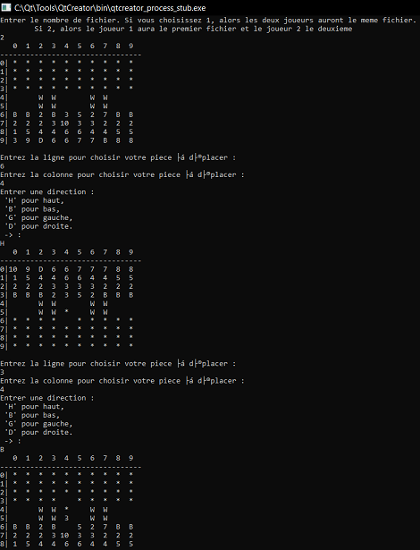

# Stratego

## Introduction

Ce dépôt contiendra le projet Stratego. Qui sera continuellement mis à jours par les binômes de cette équipe.

Ce projet respectera les différents design pattern tel que :
	1. MVC
	2. Observer/Observable

### Description du jeu
Stratego est un jeu de groupe qui a pour sujet la guerre et qui demande une grande notion de stratégie. 
L'origine du jeu nous vient des Pays-Bas, où il a été inventé peu après la Seconde Guerre mondiale. 
Mais à cette époque, le jeu restait un jeu de table. Depuis, on ne sait d'où, le jeu a été transformé non plus en jeu de société, mais en jeu de terrain : au début avec des cartes à jouer, puis avec des cartes spécialement créées

**Source : Wikipedia. Lien : https://fr.wikipedia.org/wiki/Stratego_(homonymie)**

Projet créer par :
		- Basile Routier - 54018
		- Ian Cotton - 55019

## Header
~~Tous les headers se trouvent dans le dossier Stratego~~
~~Certains headers peuvent être modifiés du au faite qu'on ne puisse pas modélisé le tout directement~~
~~Les attributs et méthodes contiennent des const pour pouvoir un accès sécurisé et plus rapide des attributs~~

## Librairie
> La librairie remplace l'ancien dossier Stratego contenant tous les fichiers sources, en-tête, etc...
	1. Permet une meilleure décomposition entre le model et notre view/controller
	2. Permet d'avoir par la suite une vue graphique et console

### Model
	Le model est dans le dossier stratego_model
		- Contient les fichiers HEADERS et SOURCES
1. ***Nous avons remplacés les pointeurs nue par des optionals 'Case' et optional'Piece'***
	1. **Cette modification s'est faite _durant_ le projet pour remplacé les pointeurs et ne plus devoir les gérés**
	2. La modification entraine aussi le faite qu'une Case contient une Piece et n'en ai pas une.
2. ***Nous avons pris en compte les commentaires postés dans le fichier COMMENTS.md de l'itération 1 et avons essayé de réduire le tout. Seul les positions sont restés inchangés car nous permet plus facilement de tester certains choses dans nos méthodes***
2. **Des modifications ont été ajoutés lors de l'interface graphique pour pouvoir faire fonctionner le jeu sans complication.**
	1. *Nous avons une méthode convertissant une position vers une direction.*
	2. *Une méthode permettant de récupérer le jeu en version tableau 2d de string permettant de savoir l'endroit des pièces et cases*

### View console
	Les classes importantes pour l'utilisation de la vue console se trouve dans le dosser stratego-view-console
		- Contient les classes importantes
			- Controller
			- View

## RAPPORT - MTD/MCD
Le diagramme de classe technique se trouve dans le dossier MCD, tous les attributs et méthodes se trouvent directement dans le diagramme
Les types et associations sont spécifiés dessus
1. **Des modifications sont à _apporter_ dans le diagramme**
	- Certaines classes ont des méthodes dépréssier et inutile
	- Des fichiers ont été supprimés pour réduire une décomposition trop extrême et ne servant à rien

### Changement dans le MTD
Certains changements ont eu lieu tel que :
	1. La modification des pointeurs vers des optional
	2. Changement de méthodes et suppression des méthodes non utilisés
	3. Respect du principe du DRY
	4. ***De gros changements, ont eu lieu aux niveaux des classes***
		- Cela est du au faite qu'une case n'est pas une pièce mais en contient une
		- Il fallait donc réadapter toute la structure de nos cases
# COMPILATION
***!!! IL EST IMPORTANT DE SUIVRE LA DEMARCHE SUIVANTE SINON LE PROGRAMME NE TROUVERA PAS LES FICHIERS DE CONFIGURATION !!!***
**Si vous décidez de modifier les fichiers texte de configuration cela n'aura AUCUN impact sur les tests**
	1. Pour compiler le projet, veuillez vous rendre sur QT et aller dans :
		1. Projets puis cliquez sur le BOUTON 'Run' et changer le 'Working directory' et modifiez vers le chemin
			- Chemin : "i-cotton-b-routier\stratego_lib"
	2. Compiler simplement en appuyant le sur bouton Buidl and Run
		- Si un message d'erreur s'affiche relancer la compilation en même temps de run et tout fonctionnera :)
	3. Sinon utiliser QMake (qui normalement se fait automatiquement)

# Implémentation

## Implémentation Console
	Utilisation :
		1. Chaque jour joue son tour et choisi une pièce pour pouvoir la déplacer dans le jeu
		2. Demandant la position de la pièce et la direction vers où aller
			- Si une pièce rencontre une autre, un combat est lancé entre les deux.
		3. Pour plus de règles, voici un lien regroupant celui-ci : https://fr.wikipedia.org/wiki/Stratego
	Image du jeu :

## Implémentation GUI
	Controller : 
		1. L'état UPDATING_BOARD n'est pas utilsé dans la version GUI
			1. Est plus compliqué à implementé (plus de code pour moins de lisibilité)
	Bouton start :
		1. Si les fichiers de configurations ne sont pas correctement configuré et que l'algorithmes le détectent -> le jeu se ferme brusquement (et aucun message n'est affiché) -> sauf en mode console ou l'erreur est affiché (à cause de l'erreur)

	### Modifications apportés
		1. Modification effectué dans Board.cpp -> initialisation du board complet dans une seul et même méthode pour la fonctionnalité restart
		2. Modifciation du Game.cpp -> ajout d'une méthode pour restart
		3. Modification du UiBoard.cpp -> pour l'update du jeu
	

